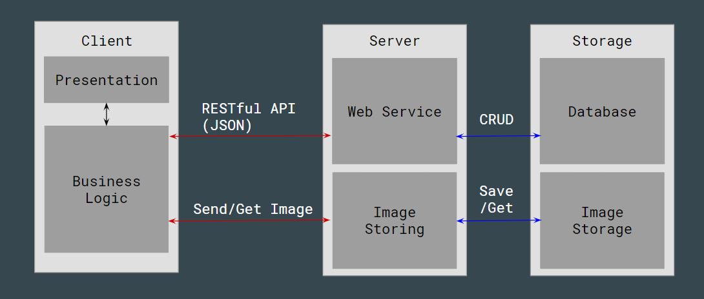
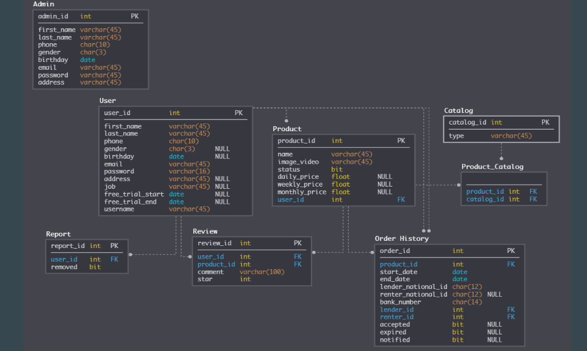

# Rentio

Currently in our lives there are so many things that we own but only use a few times, or we only need to use a few items on certain occasions. If we buy them, it may be extremely expensive and unnecessary.

The app is a solution that helps tenants quickly find the items they want to rent in the area and their prices are referenced by different tenants. The lessor will need to register with credentials that need to be verified. Users can connect with each other anywhere just via phone and wifi.

The basic functionalities:
* There is a search function for the item to be rented based on the detailed list or the specific name of the item.
* The system has the ability to store information about the goods, the official information about the lessor to ensure safety and seriousness during the rental process.
* Service respond quickly to change. For example, if a user has a change in their phone number or email, the phone number or email will be identified in the live service.
* The lessor will be notified when someone wants to register the rental of their goods. The tenant will be informed whether the lessor has confirmed whether or not to lease the goods.
* Items about to expire and expired will be notified to the lessor.
* The history of the rental invoices will be saved
* When a user reports, the admin will have the right to check the reported user information

To build the app, we use Client-Server model:

This repository totally focuses on Web Service which is built based on RESTful API to support the basic functionalities.

The task of managing the user object includes: tenants and lessors and rental items.
* Web Service: Handles HTTP (GET / POST / PUT / DELETE) methods to perform database operations based on each of them via user and item objects.
* Database: Stores information about users and items of the lessor and the lessee.

The database of Rentio Web Service:

